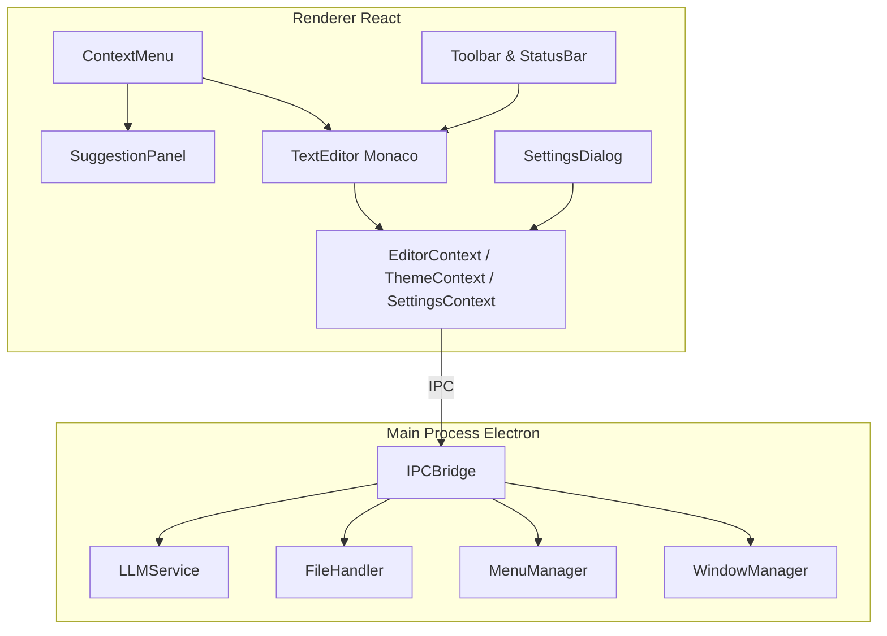

# AI Notepad App

An advanced, cross-platform desktop notepad application leveraging Electron, React, and the Monaco Editor to provide rich text editing, AI-powered grammar checking, and real-time rephrasing.

## Table of Contents
1. [Features](#features)
2. [Architecture Overview](#architecture-overview)
3. [File Structure](#file-structure)
4. [Installation](#installation)
5. [Development Workflow](#development-workflow)
6. [Building for Production](#building-for-production)
7. [Usage Examples](#usage-examples)
8. [Design & Diagrams](#design--diagrams)
9. [Key Concepts](#key-concepts)

## Features

1. **AI-Powered Grammar Checking & Rephrasing**
   - Local or cloud LLM integration via `LLMProcessor` with caching and IPC handling
   - Context-aware suggestions for grammar improvements, tone adjustments, and paraphrasing

2. **Rich Text Editing with Monaco Editor**
   - Syntax highlighting, IntelliSense, and customizable keybindings
   - Multi-language support via bundled Monaco language packages in `public/monaco-editor`

3. **Dynamic Context Menu**
   - Custom right-click menu implemented in `ContextMenu.tsx`
   - Commands: cut, copy, paste, AI suggestions, recent files, and custom actions

4. **Suggestion Panel**
   - Displays multiple AI-generated suggestions side-by-side
   - Keyboard and mouse navigation implemented in `SuggestionPanel.tsx`

5. **Undo/Redo & Edit History**
   - Utilizes Monaco’s built-in view state and undo stack
   - Persists history across sessions via `SelectionHandler`

6. **Settings Dialog**
   - Configure theme (light/dark), font size, font family, and LLM provider in `SettingsDialog.tsx`
   - Persisted using Electron Store via `SettingsContext`

7. **Persistent User Settings & File State**
   - Stores last opened files, cursor positions, and editor preferences in JSON

8. **Cross-Platform Packaging**
   - Windows, macOS, and Linux builds via Electron Forge/Electron Builder

## Architecture Overview



## File Structure

```text
ai-notepad-app/
├─ build/             # Packaged Electron assets
├─ design/            # PlantUML design diagrams
│   ├─ class_diagram.puml
│   ├─ sequence_Context_Menu_Component_Flow.puml
│   ├─ sequence_File_Operations_Flow.puml
│   ├─ sequence_LLM_Processing_Flow.puml
│   ├─ sequence_Settings_Management_Flow.puml
│   └─ sequence_Text_Editor_Component_Flow.puml
├─ main/              # Electron main (TypeScript sources)
│   ├─ constants.ts   # Application constants
│   ├─ file-handler.ts# File I/O and recent files logic
│   ├─ ipc-handlers.ts# IPC channel implementations
│   ├─ llm-service.ts # AI/Llm request orchestration
│   ├─ menu-manager.ts# Native menu definitions
│   ├─ preload.ts     # ContextBridge exposure
│   └─ window-manager.ts# Window lifecycle management
├─ public/            # Static assets and Monaco bundles
├─ src/               # React renderer
│   ├─ components/    # UI components (TextEditor, Toolbar, etc.)
│   ├─ context/       # React Context providers
│   ├─ hooks/         # Custom React hooks (useLLM, useFileOps)
│   ├─ interfaces/    # TypeScript interfaces and constants
│   ├─ services/      # Core logic (IPCBridge, LLMProcessor, UIController)
│   ├─ styles/        # CSS modules
│   └─ App.tsx        # React entry point
├─ package.json       # NPM scripts & dependencies
├─ tsconfig.json      # TypeScript configuration
└─ README.md          # Project documentation (this file)
```

## Installation

### Prerequisites
- Node.js v18+ (LTS)
- npm v8+

### Install dependencies
```powershell
npm install
```

## Development Workflow

Start renderer and main process in watch mode:
```powershell
npm run start
```

## Building for Production

**React Renderer**
```powershell
npm run react-build
```
**Electron Main**
```powershell
npm run electron-build
```
**Full Build**
```powershell
npm run build
```

## Usage Examples

1. Open or create a text file via **File ➔ Open** or **File ➔ New**.
2. Select text and right-click to open the context menu.
3. Choose **Grammar Check** or **Rephrase** to invoke AI suggestions.
4. Review and accept suggestions in the **Suggestion Panel**.
5. Use **Settings** (gear icon) to switch themes, adjust font, or change LLM provider.

## Design & Diagrams

All design diagrams are located in the `design/` folder:
- [Class Diagram](design/class_diagram.puml)
- [Context Menu Flow](design/sequence_Context_Menu_Component_Flow.puml)
- [File Operations Flow](design/sequence_File_Operations_Flow.puml)
- [LLM Processing Flow](design/sequence_LLM_Processing_Flow.puml)
- [Settings Management Flow](design/sequence_Settings_Management_Flow.puml)
- [Text Editor Component Flow](design/sequence_Text_Editor_Component_Flow.puml)


## Key Concepts

- **SelectionHandler**: Manages text selection, highlighting, and persistence.
- **LLMProcessor**: Handles AI requests for grammar and rephrasing, with caching and IPC to main process.
- **SettingsContext**: Stores user preferences and synchronizes with Electron store.

